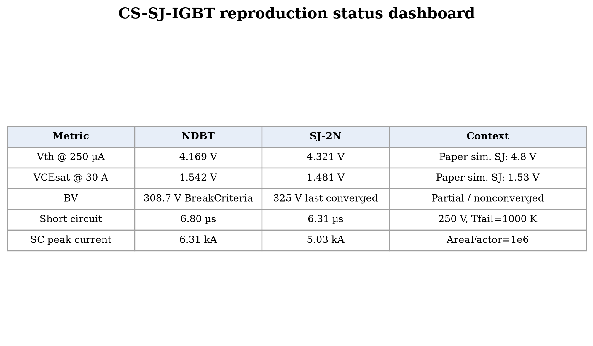

# 650 V Trench-FS CS-SJ-IGBT Sentaurus reproduction

This directory reproduces selected results from:

> Luping Li et al., “Experimental Study on 650-V Trench-FS CS-SJ-IGBT Based on 45-µm Multi-Epi SJ-Pillar,” *IEEE Transactions on Electron Devices*, vol. 72, no. 12, pp. 6912-6917, Dec. 2025. DOI: [10.1109/TED.2025.3618520](https://doi.org/10.1109/TED.2025.3618520).

The project covers a trench-FS NDBT reference and a 2N CS-SJBT, including cell/termination geometry, threshold voltage, output characteristics, DPT turn-on/turn-off, and electrothermal short-circuit simulation. It does **not** claim reproduction of the wafer process, commercial H3/H5 measurements, or the complete 4N layout.

## Workbench project

[Download the exported Workbench project](CS-SJ-IGBT.gzp).

Import it in Sentaurus Workbench with **Project > Import**, select the `.gzp`, and choose a destination under your local STDB. A licensed Sentaurus X-2025.06 installation is required.

## Main results

| Metric | NDBT | SJ-2N | Paper reference / status |
|---|---:|---:|---|
| Vth at 250 µA, VCE=5 V | 4.169 V | 4.321 V | simulated SJ: 4.8 V |
| VCEsat at 30 A, VGE=15 V | 1.542 V | 1.481 V | simulated SJ: 1.53 V |
| BV | 308.7 V BreakCriteria | 325 V last converged | partial/nonconverged |
| Short-circuit withstand | 6.80 µs | 6.31 µs | project: 250 V, Tfail=1000 K |

The short-circuit result uses `VCC=250 V`, `VGE=15 V`, `Tfail=1000 K`, and `AreaFactor=1e6`. The paper reports 400 V measured waveforms, so absolute `tsc` values are shown side by side but are not claimed to match.

## Figures

- [Structure comparison](figures/fig_00_structure_comparison.png)
- [Ic-Vg and Vth](figures/fig_01_icvg_vth_comparison.png)
- [Ic-VCE and VCEsat](figures/fig_02_icvc_vcesat_comparison.png)
- [BV - partial](figures/fig_03_bv_comparison_partial.png)
- [Turn-on](figures/fig_04_turn_on_comparison.png)
- [Turn-off](figures/fig_05_turn_off_comparison.png)
- [Short circuit](figures/fig_06_short_circuit_comparison.png)

Figures are provided in PNG format only. Selected DF-ISE `.plt` files, extracted CSV metrics, and the plotting scripts are included for reproducibility.

## Status and caveats

- Ic-Vg and Ic-VCE reruns completed successfully.
- DPT turn-on and turn-off completed under the project’s 250 V test condition.
- NDBT BV stopped at its configured current BreakCriteria near 308.7 V.
- SJ-2N BV failed numerically after the last saved point at 325 V; it is explicitly labeled nonconverged.
- Short-circuit failure is defined by the electrothermal `Tmax=1000 K` boundary, not destructive experimental failure.

See [project documentation](docs/PROJECT_DOCUMENTATION.md), [result status](docs/RESULT_STATUS.md), and [paper comparison notes](docs/PAPER_COMPARISON.md).

## Copyright and redistribution

Paper images are limited excerpts used for technical comparison. © 2025 IEEE. The complete paper is not redistributed. Sentaurus and Synopsys are trademarks of Synopsys, Inc.; use of the exported project requires a valid local installation and license. No license to third-party software or paper content is granted by this repository.
