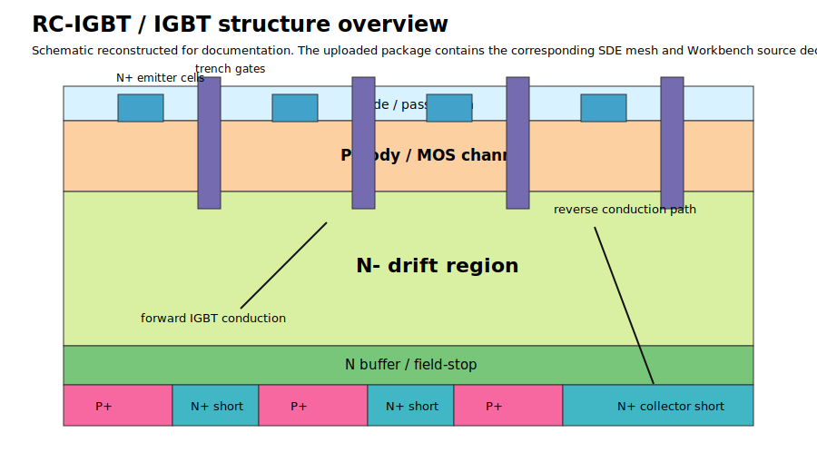
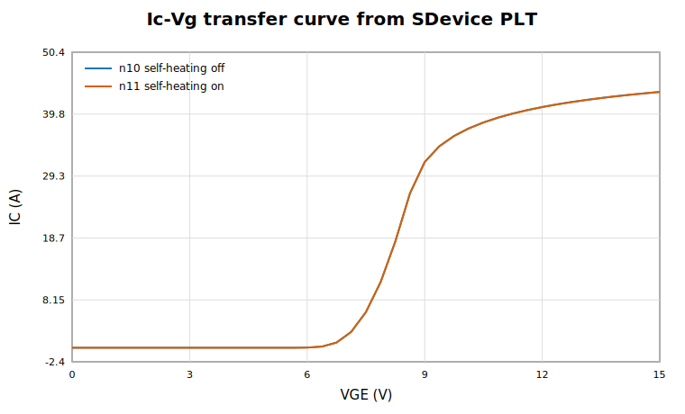
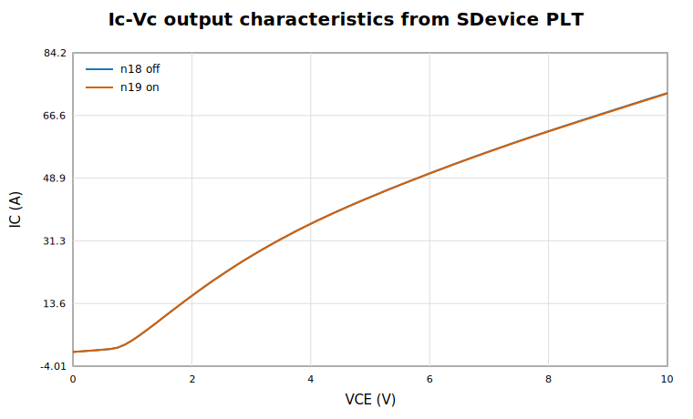
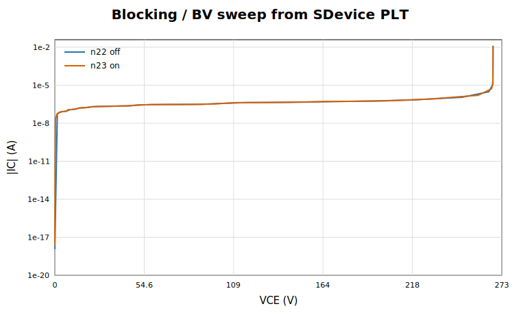
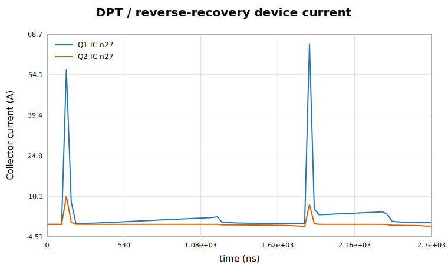
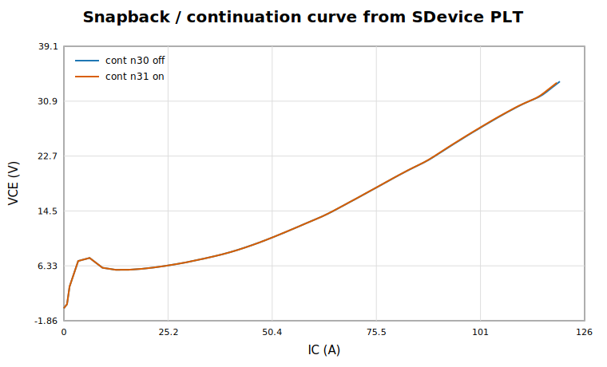

# RC-IGBT Sentaurus TCAD Project

This folder contains a cleaned public release page for an RC-IGBT Sentaurus Workbench project. The figures below are regenerated from the uploaded Sentaurus PLT result files, not manually sketched placeholder curves.

## Device structure

The structure overview summarizes the RC-IGBT / IGBT cross-section, including trench-gate MOS control, P-body, N- drift region, field-stop / buffer layer, and collector-side P / N segmentation for reverse conduction.

## SDevice results

Each figure corresponds to one major SDevice simulation deck or Workbench result group. Axes, units, legends, and log scaling are shown explicitly.

### 1. Ic-Vg transfer characteristics

Source PLT files: n10_des.plt and n11_des.plt.

### 2. Ic-Vc output characteristics

Source PLT files: n18_des.plt and n19_des.plt.

### 3. Blocking / BV sweep

Source PLT files: n22_des.plt and n23_des.plt. The y-axis is absolute collector current on a logarithmic scale.

### 4. DPT / reverse-recovery transient current

Source PLT files: DPT_Q1_n27_des.plt and DPT_Q2_n27_des.plt. The x-axis is time in ns.

### 5. Snapback / continuation curve

Source PLT files: Continuation_n30_des.plt and Continuation_n31_des.plt.

## Result coverage

| Simulation | Main files | Plot style |
|---|---|---|
| Ic-Vg transfer | n10_des.plt, n11_des.plt | IC vs VGE, linear axis |
| Ic-Vc output | n18_des.plt, n19_des.plt | IC vs VCE, linear axis |
| Blocking / BV | n22_des.plt, n23_des.plt | absolute IC vs VCE, semilog-y axis |
| DPT / reverse recovery | DPT_Q1_n27_des.plt, DPT_Q2_n27_des.plt | collector current vs time |
| Snapback | Continuation_n30_des.plt, Continuation_n31_des.plt | VCE vs IC continuation curve |

## Documentation

- rc_igbt_project_documentation.pdf: compact PDF guide.
- docs/SDEVICE_RESULT_SUMMARY.md: numeric range summary extracted from SDevice PLT files.
- docs/PROJECT_DOCUMENTATION.md: GitHub-readable project documentation.

## Public upload policy

Material parameter files, heavy binary states, logs, job files, backup folders, trial snapshots, local VM paths, and license-related files are intentionally excluded from the visible public release.

Users should provide their own legal Sentaurus installation and local material parameter files before rerunning the project.
