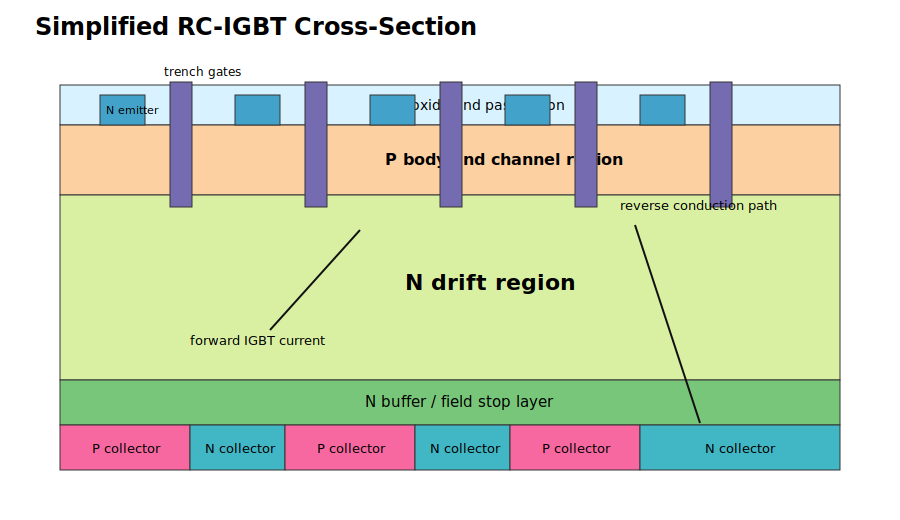
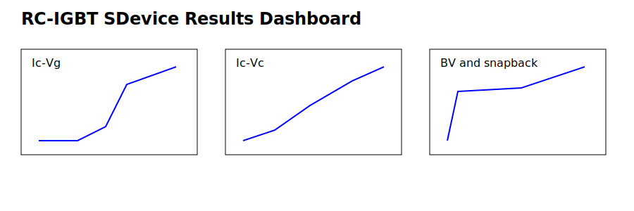

# RC-IGBT Sentaurus TCAD Project

This folder contains a cleaned public release page for an RC-IGBT Sentaurus Workbench project. The goal is to make the project easy to browse on GitHub while keeping sensitive TCAD resources out of the public tree.

## Device structure

The following schematic explains the RC-IGBT / IGBT cross-section used for documentation. It highlights the gate-side MOS control region, the N- drift region, the field-stop / buffer layer, and the collector-side P+ / N+ short segmentation used for reverse conduction.

## SDevice results at a glance

The dashboard below places the main SDevice results in the most visible part of the project page: Ic-Vg, Ic-Vc, blocking / BV, snapback, DPT / reverse-recovery transient behavior, and thermodynamic Tmax.

## Result coverage

| Simulation | Main files | Meaning |
|---|---|---|
| Ic-Vg transfer | `n10_des.plt`, `n11_des.plt` | Gate sweep with self-heating off / on |
| Ic-Vc output | `n18_des.plt`, `n19_des.plt` | Collector sweep with self-heating off / on |
| Blocking / BV | `n22_des.plt`, `n23_des.plt` | Off-state collector sweep on log-current axis |
| DPT / reverse recovery | `DPT_n26_sys_des.plt`, `DPT_n27_sys_des.plt` | System-level transient signals |
| Snapback | `n30_des.plt`, `n31_des.plt` | Continuation-style snapback inspection |
| Thermodynamic trend | `n11`, `n19`, `n23`, `n31` | Tmax comparison for self-heating runs |

## Documentation

- [`rc_igbt_project_documentation.pdf`](rc_igbt_project_documentation.pdf): compact PDF guide.
- [`docs/SDEVICE_RESULT_SUMMARY.md`](docs/SDEVICE_RESULT_SUMMARY.md): numeric range summary extracted from SDevice PLT files.
- [`docs/PROJECT_DOCUMENTATION.md`](docs/PROJECT_DOCUMENTATION.md): GitHub-readable project documentation.

## Public upload policy

Material parameter files (`*.par`), heavy binary states (`*.tdr`, `*.sav`), logs, job files, backup folders, trial snapshots, local VM paths, and license-related files are intentionally excluded from the visible public release.

Users should provide their own legal Sentaurus installation and local material parameter files before rerunning the project.
