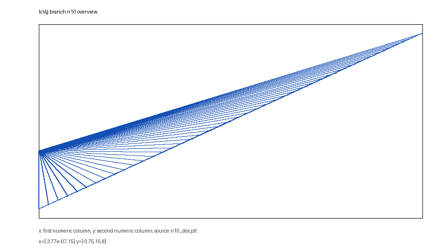
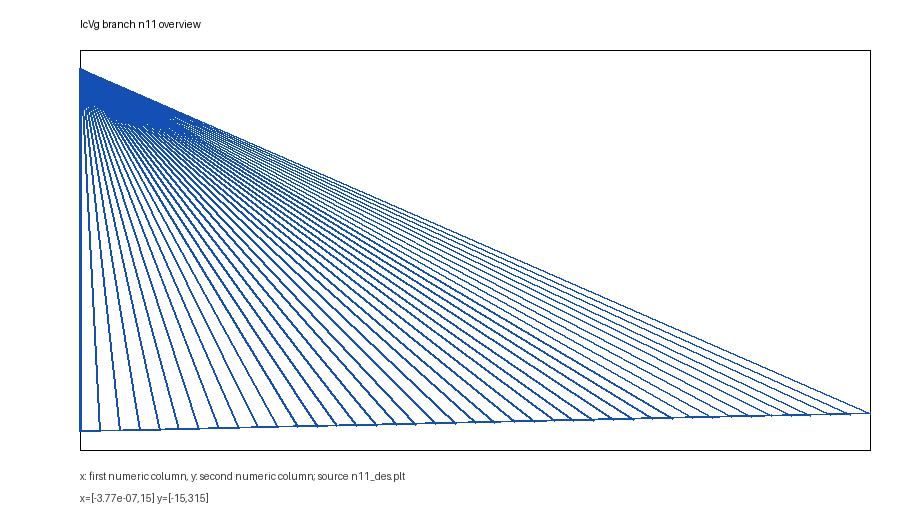
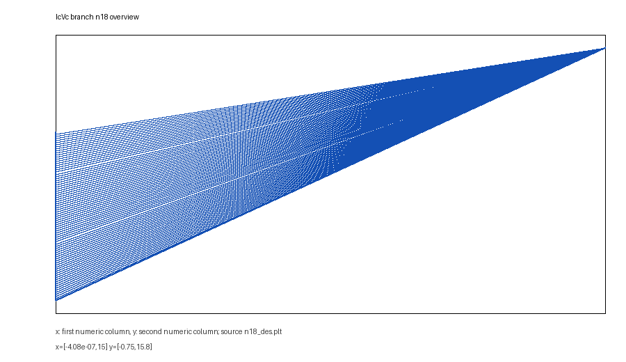
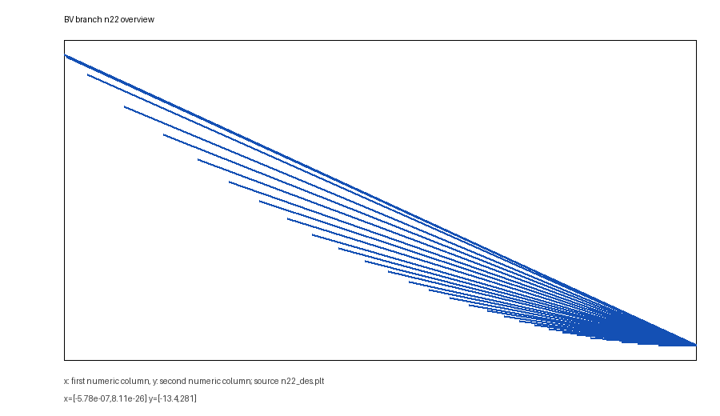
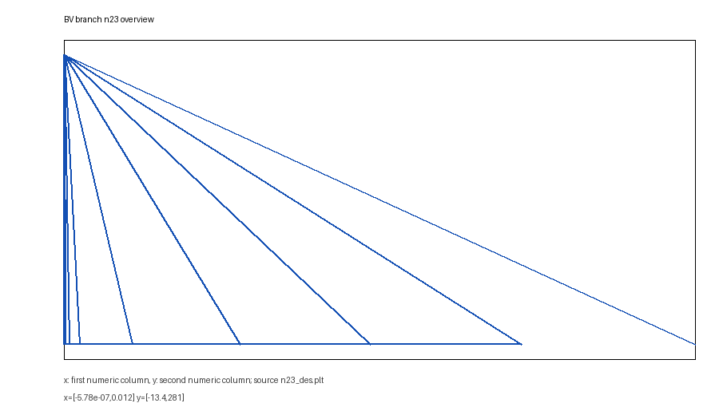
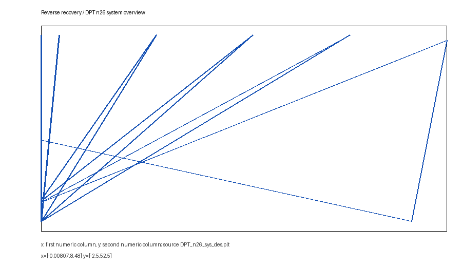
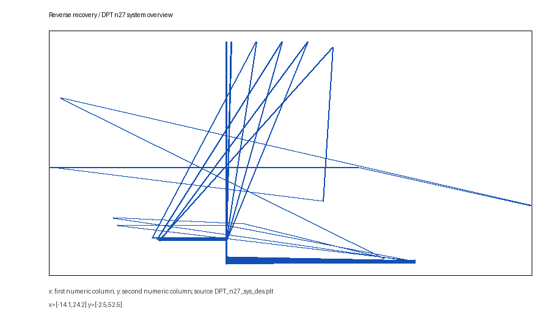
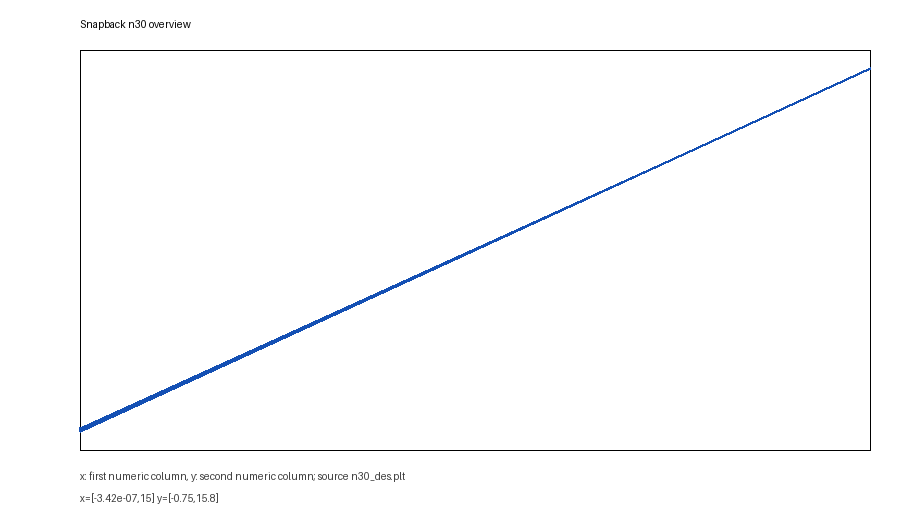
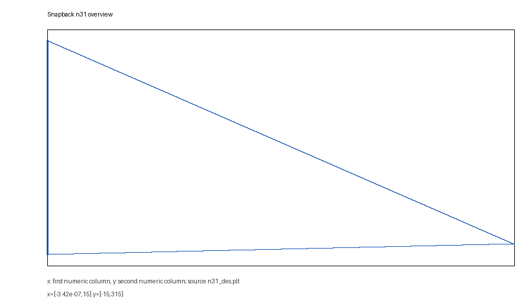

# RC-IGBT Sentaurus Workbench Project

This folder contains a sanitized public release of the Sentaurus Workbench `training/RC-IGBT` project. It is organized for review, reuse, and partial reproduction in Sentaurus Workbench.

The included `RC-IGBT_swb_project_sanitized.zip` is a public-safe lightweight import package containing Workbench metadata, source decks, generated command decks, scripts, PLT data, and status files. TDR/SAV binary states are intentionally excluded because byte-level scanning found embedded local VM/Sentaurus installation paths.

## Workbench flow

```text
sde -> IcVg -> svisual -> IcVc -> svisual1 -> BV -> svisual2 -> tran_reverse_recovery -> svisual3 -> snapback -> svisual4
```

Main source decks are under `workbench/source_decks/`. Generated `pp*.cmd` and mesh commands are under `generated_cmd/`.

## Representative results












## Reproduction notes

1. Download or import `RC-IGBT_swb_project_sanitized.zip` into a legal Sentaurus Workbench installation.
2. Provide your own local Sentaurus material parameter files. They are intentionally not distributed here.
3. Review `docs/PARAMETER_TABLE.md` before changing geometry, doping, physics, or solver settings.
4. Run structure generation before DC, reverse-recovery, or snapback nodes.
5. Generated public-safe result files in `results/` can be used for curve and status inspection even without rerunning the project. Raw TDR/SAV states are excluded from this public package.

## Documentation

- `docs/PARAMETER_TABLE.md`: geometry, doping, physics, boundary, and solver parameters.
- `docs/FILE_MANIFEST.md`: organized file inventory.
- `docs/SENSITIVE_EXCLUDES.md`: excluded content and rationale.
- `docs/REPRODUCE.md`: practical import and rerun notes.
